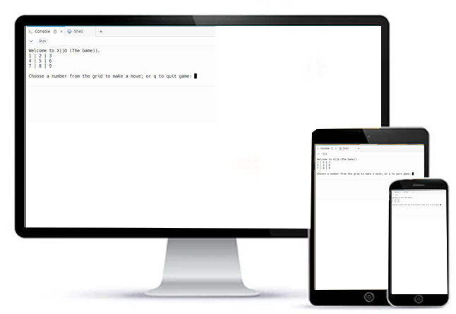

## X||O Game
The X,O game is a Python terminal game played on a three-by-three grid by player with a computer
who alternately place the marks X and O in one of the nine spaces in the grid.

#### How to play
For players or computer take turns marking the spaces in a three-by-three grid with X or O. 
The player who succeeds in placing three of their marks in a horizontal, vertical, or diagonal row is the winner.

#### Features
* Existing Feature
